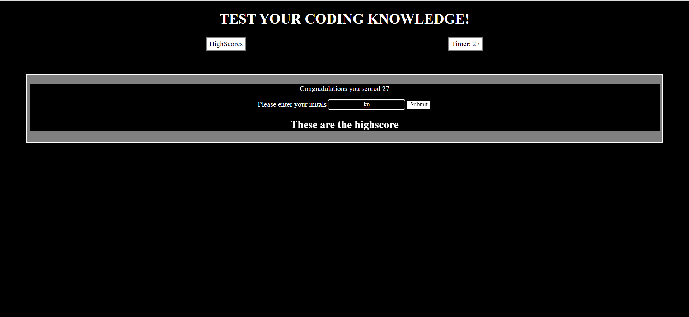
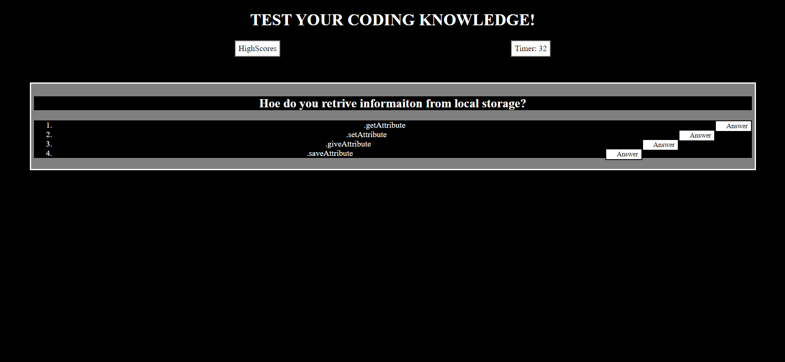

# Coding Quiz

## Description

For this project, I wanted to create a clean interactive webpage using HTML, CSS, and JavaScript to test my coding knowledge. During this project, I learned how JS navigates through the DOM of the webpage allowing coders to access exactly what they need. The quiz content helped me solidify my coding knowledge by putting it into a numerical score.

## Installation

Navigate to the live webpage using the link below. After arriving at the page simply press the start game button and you will be taken through the quiz.

https://abasheryassin.github.io/Code-quiz/

## Usage

Down below are some screenshots of the live webpage.

## License

This project uses an MIT license.

## Features

Highscores- The webpage tracks your scores to see how you improve.
